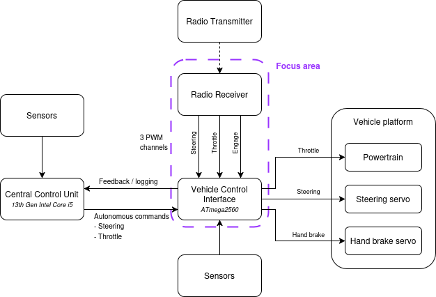
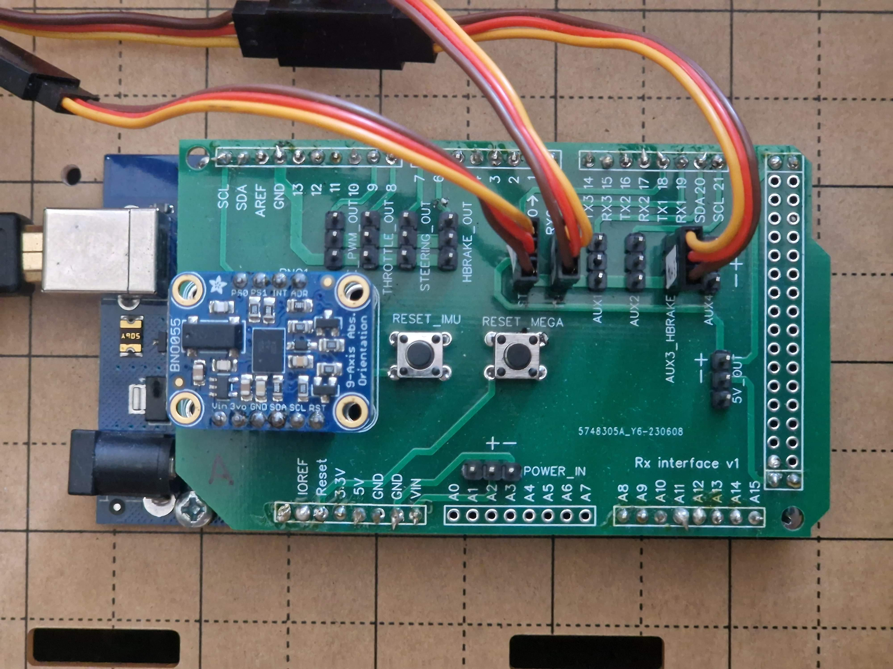
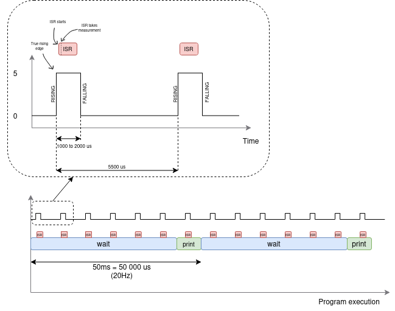
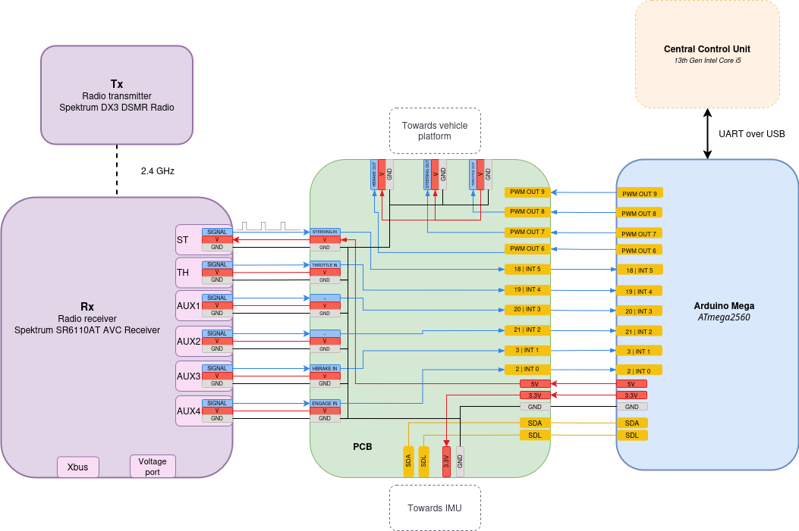

# Decoding PWM signals from a 3-channel radio receiver
Or how to hijack a remote control car with a microcontroller

This repository contains the code used in my blog post on measuring PWM signals using Arduino interrupts. It includes the Arduino sketch for capturing pulse widths, the Python script for logging serial data, and a data analysis script to visualize the results. The project explores signal stability, interrupt timing, and compares single vs multi-channel readings.

To read the full blog with detailed explanations, visit: https://mattia-p.github.io/blog/2025/05/25/decoding-pwm-signals-from-rc-receiver/

Below are a few diagrams that illustrate the structure of the project — including how the PWM signals are captured, processed, and logged. These visuals provide a high-level understanding of the setup and implementation. You can also find these diagrams, along with more detailed explanations, in the full blog post. 

  
   
  <em>Figure 1: Vehicle Control Interface diagram and project scope</em>

  
   
  <em>Figure 2: Printed Circuit Board to connect to all peripherals</em>

  
   
  <em>Figure 3: Program execution with interrupt service routines</em>

  
   
  <em>Figure 4: Wiring diagram</em>

